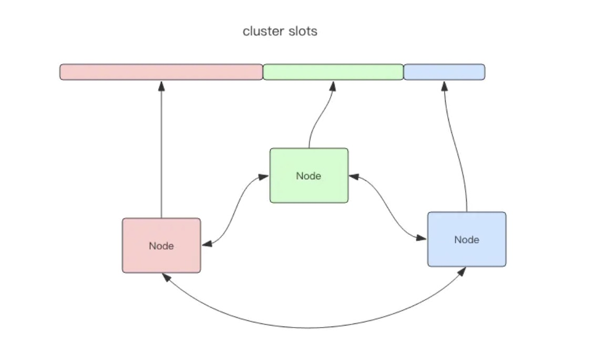

如图所示，该集群有三个 Redis 节点组成，每个节点负责整个集群的一部分数据，每个节点负责的数据多少可能不一样。这三个节点相互连接组成一个对等的集群，它们之间通过一种特殊的二进制协议相互交互集群信息。

Redis Cluster 将所有的数据划分为16384个slots，每个节点负责其中一部分槽位。槽位的信息存储在每个节点中，他不需要另外的分布式存储来存储节点槽位信息。

当 Redis Cluster 的客户端来连接集群时，他也会得到一份集群的槽位配置信息。这样当客户端要查找某个key时，可以直接定位到目标节点。

客户端为了可以直接定位某个具体的 key 所在的节点，它就需要缓存槽位相关信息，这样才可以准确快速地定位到相应的节点。同时因为槽位的信息可能会存在客户端与服务端不一致的情况，还需要纠正机制才实现槽位信息的校验调整。

另外，Redis Cluster 的每个节点会讲集群的配置信息持久化到配置文件中，所以必须确保配置文件是可写的，而且尽量不要依靠人工修改配置文件

## 槽位定位算法

Cluster 默认会对 key 值使用 crs16 算法进行 hash 得到一个数值，然后用这个整数值对16384进行取模来得到具体槽位。

Cluster 还允许用户强制某个key挂在特定槽位上，通过在key字符串里面嵌入tag标记。

## 跳转
当客户端向一个错误的节点发出了指令，该节点会发现指定的 key 所在的槽位并不归自己管理，这时它会向客户端发送一个特殊的跳转指令携带目标操作的节点地址，告诉客户端去连接这个节点去获取数据。

```
GET x
-MOVED 3999 127.0.0.1:6381
```
MOVED 指令的第一个参数3999是key对应的槽位编码，后面是目标节点地址。MOVED 指令前面有一个减号，表明该指令是一个错误消息。

客户端收到 MOVED 指令后，要立即纠正本地的槽位映射表。后续所有的key将使用新的槽位映射表。

## 容错
Redis Cluster 可以为每个节点设置若干个从节点，当主节点故障时，集群自动将其中的某个从节点提升为主节点。如果某个主节点没有从节点，那么当它发生故障时，集群将完全处于不可用状态。不过 Redis 也提供了
一个参数 cluster-require-full-coverage 可以允许部分节点故障，其它节点还可以继续提供服务。
