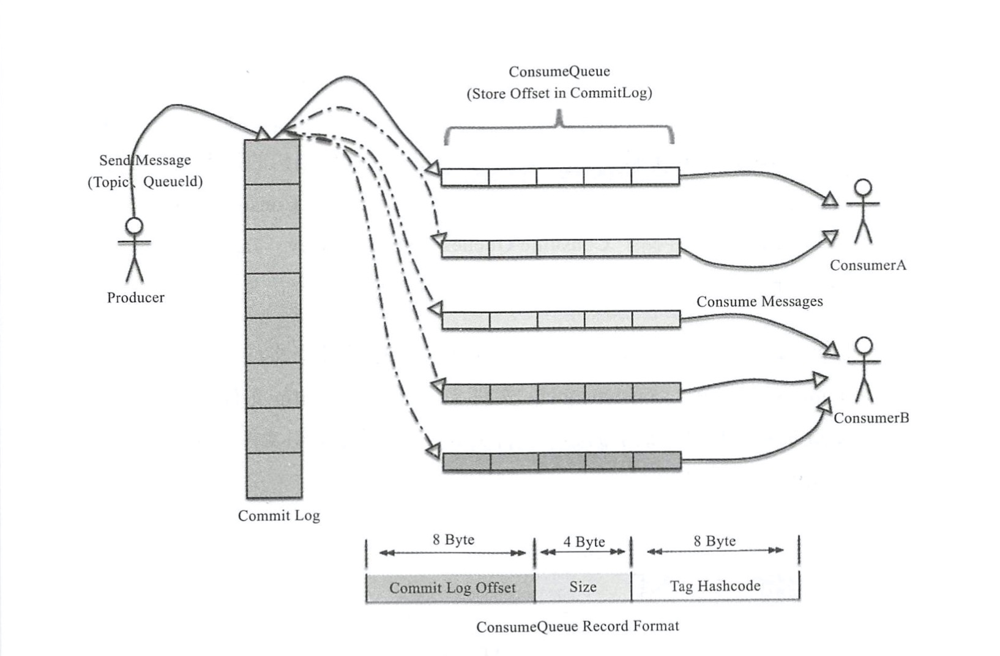

Broker 是 RocketMQ 的核心，大部分"重量级"的工作都是由 Broker 完成的，
包括接收从 Producer 发过来的消息，、处理 Consumer 的消费请求、消息的持久化、
消息的HA机制以及服务端过滤功能等
### 消息存储和发送
Linux 操作系统分为 "用户态" 和 "内核态"，文件操作、网络操作需要涉及这两种形态的切换，
免不了进行数据复制复制，一台服务器把磁盘文件数据发送到客户端，一半分为两个步骤：
- read(file,temp_buf,len)  读取本地文件内容
- write(socket,temp_buf,len) 将读取到的内容通过网络发送出去。

temp_buf 是预先申请的内存，这两个看似简单的操作，实际上进行了四次数据复制，分别是
- 从磁盘复制到内核态内存
- 从内核态内存复制到用户态内存
- 从用户态内存复制到网络驱动的内核态内存
- 网络驱动的内核内存复制到网卡中进行传输

通过使用 mmap 的方式，可以省去向用户态的内存复制，提高速度。这种机制在 Java 中
是通过 MappedByteBuffer 实现的。RocketMQ 充分利用了上述特性。也就是所谓的
"零拷贝"，提高消息存盘和网络发送的速度

### 消息存储结构

RocketMQ 消息的存储是由 ConsumeQueue 和 CommitLog 配合完成的，消息真正的物理存储文件是
CommitLog，ConsumeQueue 是消息的逻辑队列，类似数据库的索引文件，存储的是指向物理存储的地址。
每个 Topic 下的每个Message Queue 都有一个对应的 ConsumeQueue 文件。

RocketMQ 存储结构图

CommitLog 以物理文件的方式存放，每台 Broker 上的 CommitLog 被本机器上所有的 ComsumeQueue 共享。在 CommitLog 中，一个消息的存储长度是不固定的，RocketMQ 采取一些机制，尽量向 CommitLog 中顺序写，但是随机读。 
ConsumeQueue 的内容也会被写到磁盘里作持久存储。

存储机制这样设计有一下几个好处：
- CommitLog 顺序写，可以大大提升写入效率
- 虽然是随机读取，但是利用操作系统的 pagecache 机制，可以批量地从磁盘中读取，作为 cache 存到内存中，加速后续的读取速度。
- 为了保证完全的顺序写，需要 ConsumeQueue 这个中间结构，因为 ConsumeQueue 里只存偏移量信息，所以尺寸是有限的，在实际情况下，大部分的 ConsumeQueue 能够被读入内存，所以这个中间结构的操作 速度是很快的，可以认为是内存
读取的速度。此外为了保证 CommitLog 和 ConsumeQueue 的一致性，CommitLog 里存储了Consume Queues、 Message Key 、Tag 等所有信息，即使 ConsumeQueue 丢失，也可以通过 CommitLog 完全恢复出来